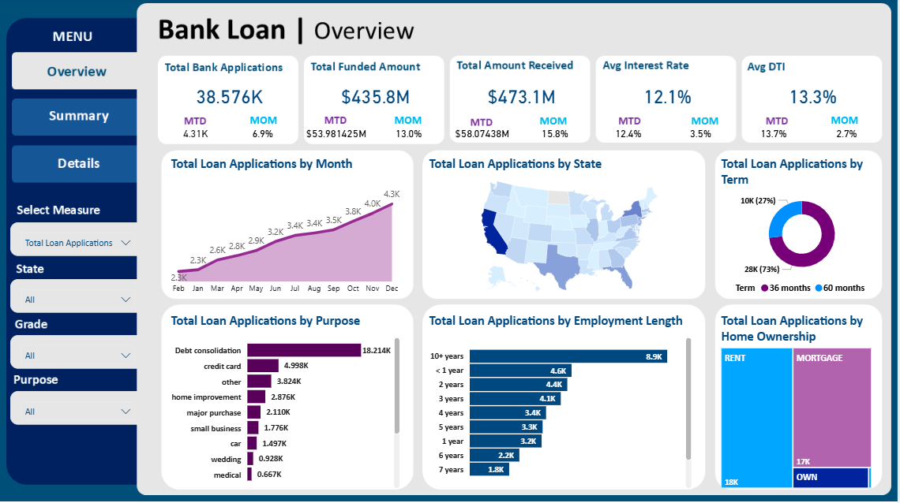
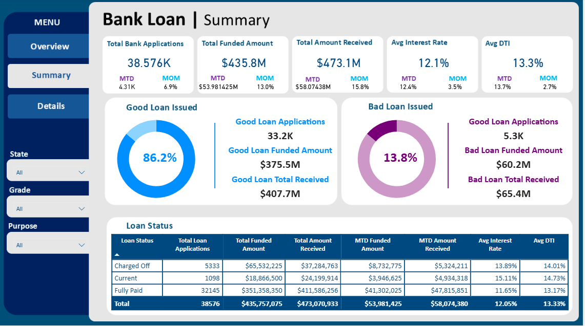
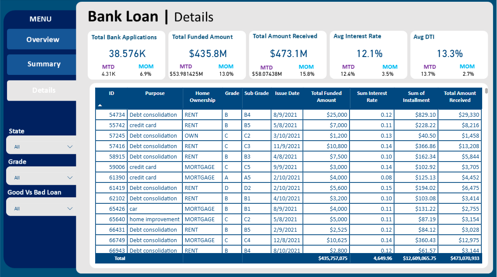

# Bank Loan Analysis – SQL & Power BI

##  Project Overview
This project combines **business domain knowledge** with **SQL analysis** and **Power BI visualization** to study bank loan data.  
The goal is to understand **loan performance (good vs bad loans)**, analyze borrower behavior, and provide insights that support **risk management, portfolio monitoring, and decision-making**.  

---

## Domain Knowledge
Bank loans are critical financial tools that help individuals and businesses achieve goals.  
However, banks must carefully **assess risk** and borrowers must understand **terms, costs, and responsibilities**.  

## Dataset
**File:** `bank_loan.xlsx`  
**Size:** = `38,576` loan application records  
**Source:** Simulated banking dataset 

### **Columns Description**
| Column Name         | Description |
|---------------------|-------------|
| `id`                | Unique loan ID |
| `address_state`     | Borrower's state (USA) |
| `emp_length`        | Employment length (Years) |
| `emp_title`         | Borrower's occupation |
| `grade`             | Loan grade assigned by the bank (A = best quality, G = highest risk) |
| `home_ownership`    | Type of home ownership |
| `issue_date`        | Date the loan was issued |
| `loan_status`       | Loan repayment status (Fully Paid, Current, Charged Off) |
| `purpose`           | Loan purpose (e.g., credit card, debt consolidation) |
| `sub_grade`         | More detailed classification (e.g., A1–A5, B1–B5) within each grade |
| `term`              | Loan repayment term (36 or 60 months) |
| `dti`               | Debt-to-income ratio |
| `installment`         | Monthly payment owed by the borrower (principal + interest) |
| `int_rate`          | Annual interest rate (%) |
| `loan_amount`       | Amount funded by the bank |
| `total_payment`     | Total amount received from the borrower |

##  SQL Analysis
All queries are available in **`bank_loan_queries.sql`**.

## Extracted Metrics
- **Overall KPIs**
  - Total Loan Applications
  - Total Funded Amount
  - Total Amount Received
  - Average Interest Rate
  - Average Debt-to-Income Ratio (DTI)

- **Time-based Metrics**
  - Month-to-Date (MTD) statistics:
    - MTD Loan Applications
    - MTD Funded Amount
    - MTD Amount Received
    - MTD Average Interest Rate
    - MTD Average DTI
  - Previous Month (PMTD) statistics for comparison
  - Month-over-Month (MoM) Growth:
    - MoM Loan Applications
    - MoM Funded Amount
    - MoM Amount Received
    - MoM Average Interest Rate
    - MoM Average DTI
      
 -  **Loan Quality Metrics**
    - Good Loan Applications (Fully Paid, Current)
    - Bad Loan Applications (Charged Off)
    - Good Loan % vs Bad Loan %

 - **Borrower Segmentation**
   - Loan distribution by:
      - State
      - Term
      - Purpose
      - Loan Status
      - Employment length
      - Home ownership
      - Grade & Sub Grade
    
  ##  Power BI Dashboard
The SQL results are visualized in Power BI to create an **interactive dashboard**. 

###  Dashboard 1: Overview & Key KPIs

**Key Visuals**
- **Total Loan Applications** – total number of loans issued  
- **Total Funded Amount** – total principal funded by the bank  
- **Total Amount Received** – repayments received from borrowers  
- **Average Interest Rate** – average rate applied across loans  
- **Average Debt-to-Income Ratio (DTI)** – measure of borrower repayment capacity

**👥 Borrower Demographics**

Visuals that segment borrowers by personal and loan-related attributes:  
- **By Purpose** – reasons for borrowing (debt consolidation, credit card, education, etc.)  
- **By Employment Length** – stability of borrower employment  
- **By Loan Term** – repayment duration (36 months vs 60 months)  
- **By Home Ownership** – type of housing situation (rent, own, mortgage, etc.)

**🗺 Geographic Distribution**

A **map visualization** showing the number of loan applications and amounts distributed **by U.S. state**.  

These visuals allow financial institutions to:
- Monitor portfolio growth and repayment inflows over time  
- Identify regional lending patterns  
- Understand borrower profiles and behaviors
  
*Dashboard Preview:*  

### Dashboard 2: Summary

This dashboard focuses on **loan quality and repayment status**.  

**Key Visuals**
- **Good Loan % vs Bad Loan % (Donut Chart)** – compares the proportion of successfully repaid/current loans vs defaulted (charged off) loans.  
- **Loan Status Table** – provides a detailed breakdown of loan applications, funded amounts, amounts received,interest rate, dti, and risk metrics across different statuses (Fully Paid, Current, Charged Off).  

These visuals allow banks to:
- Assess the **overall health** of the loan portfolio  
- Track the proportion of loans at risk (defaults)  
- Monitor repayment trends across different loan categories  

*Dashboard Preview:*  

### Dashboard 3: Loan Details  

This dashboard provides a **granular, record-level view of loan applications** to support auditing, compliance, and borrower-level analysis.  

**Key Visuals**  
- **Loan ID** – unique identifier for each loan application  
- **Purpose** – borrower’s reason for taking the loan  
- **Home Ownership** – borrower’s housing status (rent, own, mortgage)  
- **Grade & Sub-Grade** – credit risk classification assigned by the bank  
- **Issue Date** – loan origination date for time-based analysis  
- **Total Funded Amount** – principal amount funded by the bank  
- **Installments (Sum)** – total repayment obligations for the borrower  
- **Interest Rate** – annual borrowing cost applied to the loan  
- **Total Amount Received** – repayments collected to date  

These visuals allow financial institutions to:  
- Drill down into **individual loans** for detailed monitoring  
- Compare **funded vs received amounts** to check repayment progress  
- Analyze borrower characteristics to improve **risk assessment**  
- Ensure **transparency and accountability** in loan management 

*Dashboard Preview:*  

##  Tools Used
- **SQL (MySQL/SQL Server)** – Data analysis  
- **Power BI** – Dashboard & Visualization  
- **xlsx dataset** – Loan records  

##  Key Findings
**1.** Good loans dominate the portfolio; bad loans are low.
**2.** Debt consolidation and credit card loans are the most common.
**3.** High loan volumes in CA, TX, FL, and NY.
**4.** Borrowers with 10+ years of employment have higher funded amounts.
**5.** Peak loan activity are in November and December.

---
